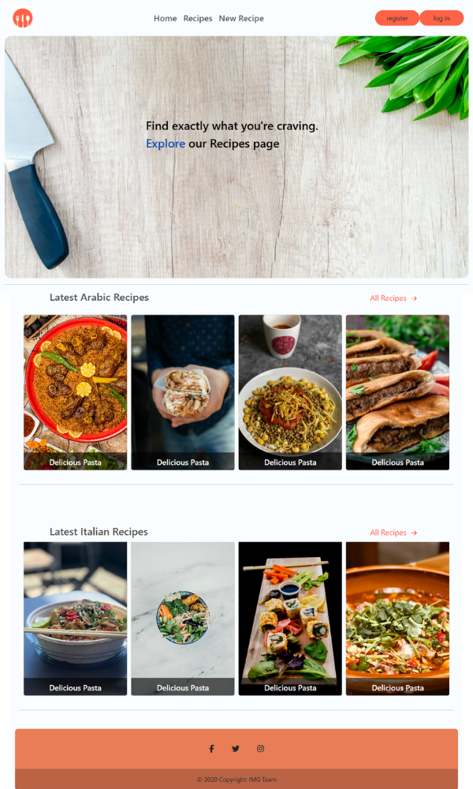
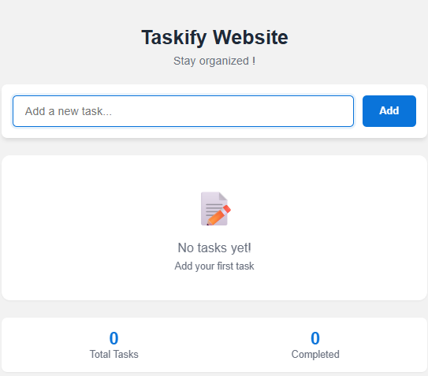
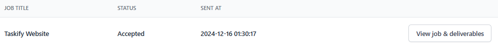
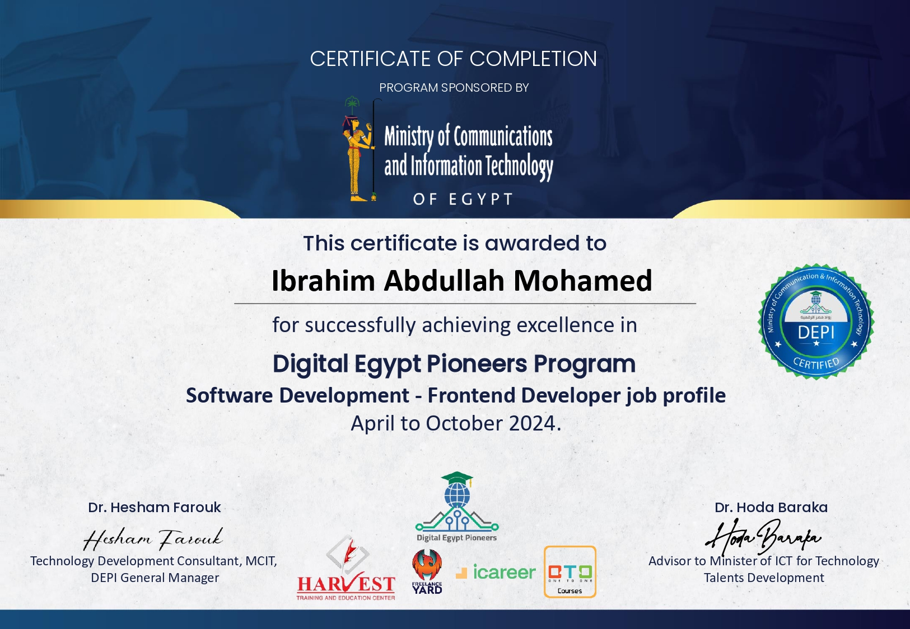
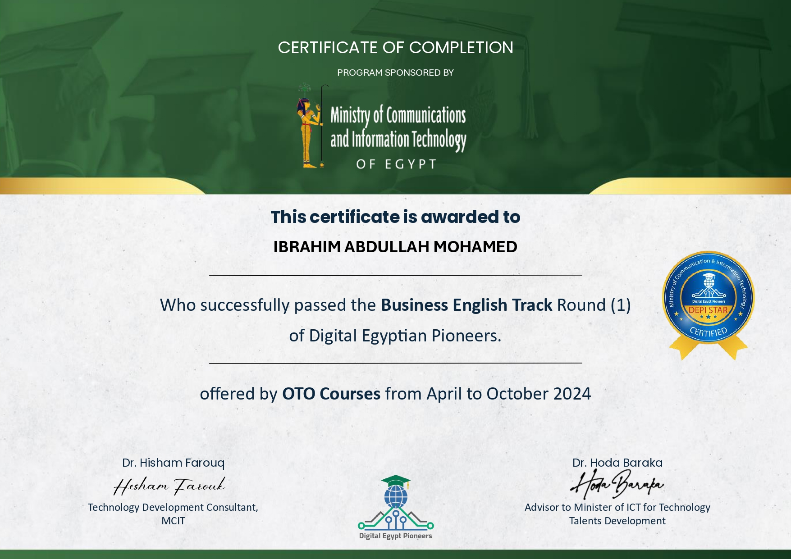

# DEPI R1 - Frontend Tasks (Frontend Angular Track)

This repository contains all frontend tasks completed during Round 1 of the Digital Egypt Pioneers Initiative.  
All tasks are located inside the `All-tasks` directory.

---

## 🔗 Task Links

| #   | Task Name             | 🔗 Code                                    | 🌐 View                                                                                      |
| --- | --------------------- | ------------------------------------------ | -------------------------------------------------------------------------------------------- |
| 1   | Task1                 | [Code](./All-tasks/Task1/)                 | [View](https://ibraheamit.github.io/depi-r1-frontend-tasks/All-tasks/Task1/)                 |
| 2   | Task2_map             | [Code](./All-tasks/Task2_map/)             | [View](https://ibraheamit.github.io/depi-r1-frontend-tasks/All-tasks/Task2_map/)             |
| 3   | Task3_Media&iframe    | [Code](./All-tasks/Task3_Media&iframe/)    | [View](https://ibraheamit.github.io/depi-r1-frontend-tasks/All-tasks/Task3_Media&iframe/)    |
| 4   | Task4_form            | [Code](./All-tasks/Task4_form/)            | [View](https://ibraheamit.github.io/depi-r1-frontend-tasks/All-tasks/Task4_form/)            |
| 5   | Task5_margin          | [Code](./All-tasks/Task5_margin/)          | [View](https://ibraheamit.github.io/depi-r1-frontend-tasks/All-tasks/Task5_margin/)          |
| 6   | Task6_box-sizing      | [Code](./All-tasks/Task6_box-sizing/)      | [View](https://ibraheamit.github.io/depi-r1-frontend-tasks/All-tasks/Task6_box-sizing/)      |
| 7   | Task7_header-rasia    | [Code](./All-tasks/Task7_header-rasia/)    | [View](https://ibraheamit.github.io/depi-r1-frontend-tasks/All-tasks/Task7_header-rasia/)    |
| 8   | Task8_social-media    | [Code](./All-tasks/Task8_social-media/)    | [View](https://ibraheamit.github.io/depi-r1-frontend-tasks/All-tasks/Task8_social-media/)    |
| 9   | Task9_header-raco     | [Code](./All-tasks/Task9_header-raco/)     | [View](https://ibraheamit.github.io/depi-r1-frontend-tasks/All-tasks/Task9_header-raco/)     |
| 10  | Task10_simile-bite    | [Code](./All-tasks/Task10_simile-bite/)    | [View](https://ibraheamit.github.io/depi-r1-frontend-tasks/All-tasks/Task10_simile-bite/)    |
| 11  | Task11_kids-stories   | [Code](./All-tasks/Task11_kids-stories/)   | [View](https://ibraheamit.github.io/depi-r1-frontend-tasks/All-tasks/Task11_kids-stories/)   |
| 12  | Task12_Trips          | [Code](./All-tasks/Task12_Trips/)          | [View](https://ibraheamit.github.io/depi-r1-frontend-tasks/All-tasks/Task12_Trips/)          |
| 13  | Task13_Portfolio      | [Code](./All-tasks/Task13_Portfolio/)      | [View](https://ibraheamit.github.io/depi-r1-frontend-tasks/All-tasks/Task13_Portfolio/)      |
| 14  | Task14_CSS-Calculator | [Code](./All-tasks/Task14_CSS-Calculator/) | [View](https://ibraheamit.github.io/depi-r1-frontend-tasks/All-tasks/Task14_CSS-Calculator/) |
| 15  | Task15_disney         | [Code](./All-tasks/Task15_disney/)         | [View](https://ibraheamit.github.io/depi-r1-frontend-tasks/All-tasks/Task15_disney/)         |
| 16  | Task16_disney-login   | [Code](./All-tasks/Task16_disney-login/)   | [View](https://ibraheamit.github.io/depi-r1-frontend-tasks/All-tasks/Task16_disney-login/)   |
| 17  | Task17_js-emojis      | [Code](./All-tasks/Task17_js-emojis/)      | [View](https://ibraheamit.github.io/depi-r1-frontend-tasks/All-tasks/Task17_js-emojis/)      |
| 18  | Task18_JS-Calculator  | [Code](./All-tasks/Task18_JS-Calculator/)  | [View](https://ibraheamit.github.io/depi-r1-frontend-tasks/All-tasks/Task18_JS-Calculator/)  |
| 19  | Task19_JS-Quiz        | [Code](./All-tasks/Task19_JS-Quiz/)        | [View](https://ibraheamit.github.io/depi-r1-frontend-tasks/All-tasks/Task19_JS-Quiz/)        |

---

## 🧑‍🎓 Graduation Project

### 📌 Project Title: Recipe Sharing

> A simple and responsive recipe sharing website where users can browse and explore various cooking recipes.

- 🔗 **Code**: [GitHub Folder](./All-tasks/Graduation-Project/Recipe-Sharing/)
- 🌐 **Live Demo**: [View Project](https://ibraheamit.github.io/depi-r1-frontend-tasks/All-tasks/Graduation-Project/Recipe-Sharing/)

---

### 🔧 Tech Stack

- HTML5
- CSS3
- JavaScript

---

### 🖼️ Project Screenshot

---

## 🧑‍💻 Freelance Project: Taskify Website

### 📌 Project Title: Taskify To-Do List Application

> A responsive to-do list web application developed for Taskify, a fictional productivity tool. The app allows users to add, delete, and mark tasks as complete, providing an intuitive and interactive task management experience.

- 🔗 **Code**: [GitHub Repository](./All-tasks/Taskify-Website/)
- 🌐 **Live Demo**: [View Project](https://ibraheamit.github.io/depi-r1-frontend-tasks/All-tasks/Taskify-Website/)

---

### 🔧 Tech Stack

- HTML5
- CSS3
- JavaScript

---

### 🖼️ Project Screenshot

---

## ✅ Job Acceptance Proof

### 📄 Accepted Freelance Job: Taskify Website

---

## 🏅 Achievements & Certificates

Here are the official certificates I received during the DEPI R1 Program:

<h2>📜 Certificates</h2>

<h3>🎓 DEPI R1 - Frontend Developer</h3>

<h3>🎓 DEPI R1 - Business English</h3>

